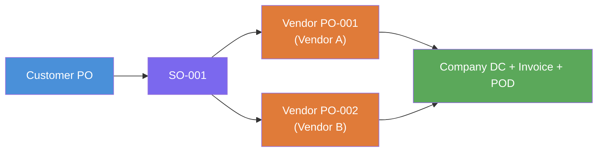
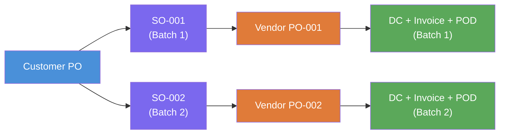
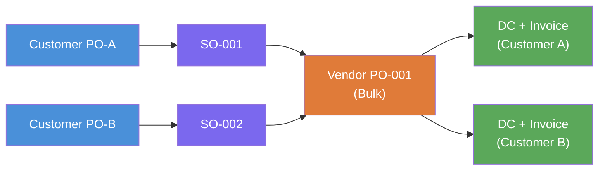

# Product Definition Document (PDD)
## Document Traceability & File Management Platform
### Logistics: Customer PO → Vendor Procurement → Delivery → Archival

---

## Version History

| Version | Date | Description |
|---|---|---|
| 0.1 | 2026-01-13 | Initial PDD — AS-IS analysis, MVP scope, NAS-based portal concept |
| 2.3.0 | 2026-03-17 | Implemented: AI extraction pipeline, staging deployment, CI/CD pipeline |

---

## 1. Executive Summary

This PDD defines a centralised, on-premise platform to improve file management and document traceability for a logistics-oriented order lifecycle. The platform links all documents created against a customer requirement to a single unique ID and enables fast retrieval (file path + optional preview/download), with governance controls such as audit logs and approval-based update/delete.

---

## 2. Business Context

**Business flow:**
Customer issues PO → Company performs internal processing and procurement → Issues Vendor PO → Receives vendor material/license with vendor invoice and DC → Delivers to customer with company invoice/DC → Collects signed acknowledgement (POD).

**Current tools/systems:**
- **Zoho CRM** — leads, opportunities, quotes/proposals (used for validation and status updates)
- **Core ERP** — sales order (SO), OES, approvals, vendor PO, GRN, purchase bill, tax invoice/DC
- **Microsoft Outlook** — external communication with vendors (sending vendor PO PDFs)
- **NAS / intranet shared folders** — central repository for exports and scanned hard copies
- **Excel** — tracking

---

## 3. Problem Statement

**Observed pain points:**
- Documents are scattered across ERP, email, and multiple NAS folders — hard to find the right file at the right time
- During re-queries (customer/vendor follow-ups), teams struggle to confirm which documents exist for a specific customer requirement and where they are stored
- Required document set spans both company-side and vendor-side files (Customer PO; Vendor PO/DC/Invoice; Company Invoice/DC; signed acknowledgement/POD)
- Missing or misplaced files create operational risk
- Vendor negotiation and procurement variability causes timeline shifts, making it harder to track the latest document set

**What the business expects:**
- Assign a unique ID per customer requirement (or reuse an existing stable ID)
- When a user enters the ID, the platform fetches and displays all related documents with file paths (Must), and optionally a preview + download (Good-to-have)

---

## 4. Objectives & Success Metrics

**Objectives:**
- Single view of all documents tied to a unique customer requirement ID
- Reduce document retrieval time and eliminate ad-hoc folder searching
- Improve governance with audit logs and approval-based privileged actions
- Enable incremental integration with ERP/CRM once documentation/access is available

**Candidate success metrics:**
- Average time to locate a case's key documents < 30 seconds
- ≥ 95% of cases meet the configured document checklist
- 100% of delete/update operations are approved and audited

---

## 5. Stakeholders & Users

| Role | Responsibility |
|---|---|
| Sales Coordinator | Receives Customer PO; validates against quote in Zoho CRM; updates opportunity status |
| Order Processing / OES | Creates SO/OES, attaches PO, manages approvals and costing updates |
| Purchase Team | Vendor negotiation, vendor PO creation, reschedule adjustments, release of vendor PO PDF |
| Logistics / Stores | GRN creation, inward validation, scanning vendor documents for archival |
| Finance | Purchase bill entry, tax invoice generation, compliance |
| Admin | Archival/scanning for customer delivery documents |
| Head / Manager | Approver for delete/update actions |

---

## 6. Current Process (AS-IS)

| Phase | Owner(s) | Key Activities | Primary Documents |
|---|---|---|---|
| 1. Input & Validation | Sales Coordinator / Ops | Receive customer PO (email); cross-check quote in Zoho CRM; update opportunity status | Customer PO; Quote/Proposal reference |
| 2. Order Entry & OES | Ops / OES / Finance | Create SO in ERP; attach PO; create OES (risk & margin checks); BOM entry; sequential internal approvals | SO; OES; BOM; approvals |
| 3. Procurement | Purchase Team | Offline vendor negotiation; vendor PO in ERP; reschedule when timelines shift; release PO PDF via Outlook | Vendor PO PDF; (re)schedule updates |
| 4. Inward Processing | Logistics / Stores / Finance | Vendor delivers material/license + vendor invoice/DC; create GRN; create purchase bill; update OES with actuals | GRN; Vendor Invoice; Vendor DC; Purchase Bill |
| 5. Outward & Closure | Ops / Logistics / Finance | Generate company DC and tax invoice; deliver to customer; collect signed POD/acknowledgement | Company Invoice; Company DC; Signed POD/Ack |

---

## 7. Document Taxonomy & Checklist

### 7.1 Document Types

**Customer-side:**
- Customer PO (official PO PDF)
- Company Tax Invoice
- Company Delivery Challan (DC) — hardware scenario
- Signed customer acknowledgement / POD

**Vendor-side:**
- Vendor PO (company to vendor)
- Vendor Invoice
- Vendor Delivery Challan (DC)

**Internal supporting:**
- SOW, Quote/Proposal, BOM, OES, SO, GRN, Purchase Bill

### 7.2 Implemented Document Types (DPP v2.3.0)

| Enum Value | Direction | Primary Key Field | Status |
|---|---|---|---|
| CUSTOMER_PO | Customer → Us | po_number | ✅ Implemented |
| COMPANY_PO | Us → Vendor | purchase_bill_no | ✅ Implemented |
| VENDOR_DC | Vendor → Us | dc_number | ✅ Implemented |
| VENDOR_INVOICE | Vendor → Us | invoice_number | ✅ Implemented |
| COMPANY_DC | Us → Customer | dc_number | ✅ Implemented |
| COMPANY_INVOICE | Us → Customer | invoice_number | ✅ Implemented |
| Signed POD / Acknowledgement | Customer → Us | — | ❌ Not yet implemented |

### 7.3 Minimum Metadata Fields

Case ID, Customer name, Customer PO number/date, Opportunity ID, SO number, Vendor name, Document type, Document number, Document date, Status (draft/signed), Source system, Storage location, Last modified date, Uploaded/linked by.

---

### 7.4 Document Flow by Order Type

Orders fall into three types, each with different document chain requirements.

#### Document Requirement Matrix

| Document | Trade / Software | Services (AMC, Cloud) | Stock / Inventory |
|---|---|---|---|
| Customer PO | Required | Required | Required |
| SO (internal) | Required | Required | Required |
| Vendor PO | Required | Required | Not applicable |
| Vendor DC | Required | If applicable | Not applicable |
| Vendor Invoice | Required | Required | Not applicable |
| Company DC | Required | If applicable | Required |
| Company Invoice | Required | Required | Required |
| POD | Required | Required | Required |

> **Services note:** Vendor DC and Company DC may or may not be generated depending on the vendor and delivery method. The chain is considered complete without them — they are "if applicable", not mandatory.
>
> **Stock/Inventory note:** When the ordered item is available in inventory, the entire vendor procurement block (Vendor PO → Vendor DC → Vendor Invoice) is skipped. The order is fulfilled directly from stock.

---

#### Type 1 — Trade / Software (Full Chain)


---

#### Type 2 — Services / AMC / Cloud (DC Optional)


---

#### Type 3 — Stock / Inventory Fulfillment (No Vendor Block)


> **Future enhancement:** Chain completeness % currently treats all 6 document types equally for all orders. A future `order_type` flag on the PO will allow the system to calculate completeness correctly per order type — e.g., a Services order at 6/6 applicable documents = 100%, even if Vendor DC was not generated.

---

### 7.5 Purchase Order Scenarios — CPO : SO : VPO Relationships

#### SO as the Backbone

The Sales Order (SO) is the internal reference that ties the entire chain together:

```
Customer PO received → SO generated internally
    ↓
Vendor PO raised against SO (SO is the procurement reference)
    ↓
Vendor Invoice/DC arrives against Vendor PO
    ↓
Company uses Vendor PO → SO → Customer to trace the full chain
```

#### Relationship Matrix

| CPO | SO | VPO | Description |
|---|---|---|---|
| 1 | 1 | 1 | Standard single-vendor fulfillment |
| 1 | 1 | Many | One order, items from multiple vendors |
| 1 | Many | Many | One CPO split into batches or separate line item flows |
| Many | Many | 1 | Multiple customer SOs fulfilled via one bulk vendor purchase |
| Many | Many | Many | Multiple independent customer orders, each with own chain |

> **Key rule:** SO and VPO have a **many-to-many relationship**. One SO can have multiple VPOs (multi-vendor), and one VPO can serve multiple SOs (bulk procurement).

---

#### Scenario 1 — Standard (1 CPO : 1 SO : 1 VPO)

Most common case. Single customer order, single vendor.


---

#### Scenario 2 — Multi-Vendor (1 CPO : 1 SO : Many VPO)

Customer orders items from different vendors. One SO, multiple Vendor POs raised.



---

#### Scenario 3 — Split Delivery (1 CPO : Many SO : Many VPO)

Customer PO is large — delivered in batches. Each batch gets its own SO and vendor procurement.



---

#### Scenario 4 — Bulk Procurement (Many SO : 1 VPO)

Company bulk-buys from one vendor to fulfill multiple customer SOs in a single Vendor PO (cost efficiency / stock replenishment).



---

#### Architectural Gap — Current System

| Aspect | Current System | Reality |
|---|---|---|
| CPO → SO | 1 PO record = 1 SO number field | 1 CPO can generate multiple SOs |
| SO → VPO | No explicit SO↔VPO link | Many-to-many relationship |
| Bulk procurement | Not tracked | 1 VPO can serve multiple SOs |
| Partial delivery | Not tracked | 1 CPO can have multiple delivery batches |

**Current limitation:** The `purchase_orders` table stores one `so_number` per PO — assumes 1:1 between PO and SO. The system cannot currently link one Vendor PO to multiple SOs or track partial deliveries against a single CPO.

**Future fix:** Introduce a `SalesOrder` entity and a `SOVendorPOLink` join table to properly model the many-to-many relationship between SOs and Vendor POs.

---

### 7.6 Billing Scenarios

#### Billing Types

| Type | Description | Typical Order |
|---|---|---|
| Full billing | Single invoice for the entire PO amount | Trade / Software / Stock |
| Partial billing | Invoice raised per batch / per delivery | Split delivery (Scenario 3) |
| Recurring billing | Invoice raised on a fixed schedule | Services / AMC / Cloud |

---

#### Type 1 — Full Billing

One Customer PO → one SO → one Company Invoice for the full amount. Most straightforward case.

```
Customer PO (100%) → SO → Vendor PO → Vendor Invoice → Company Invoice (100%) → POD
```

---

#### Type 2 — Partial Billing

Customer PO delivered and billed in batches. Each batch generates its own Company DC and Company Invoice for that portion.

```
Customer PO (total ₹100)
    ├── Batch 1 (₹40) → SO-001 → Vendor PO-001 → Company DC-001 + Invoice-001
    └── Batch 2 (₹60) → SO-002 → Vendor PO-002 → Company DC-002 + Invoice-002
```

> Sum of all partial invoices = total Customer PO value.

---

#### Type 3 — Recurring Billing

Used for service contracts (AMC, cloud subscriptions, support contracts). The same contract generates invoices periodically over the contract duration.

**Billing frequencies:**

| Frequency | Invoices per year | Example |
|---|---|---|
| Monthly | 12 | Cloud subscription billed monthly |
| Quarterly | 4 | Maintenance contract billed per quarter |
| Half-yearly | 2 | AMC billed twice a year |
| Yearly | 1 | Annual license renewal |

**Two sub-cases depending on vendor arrangement:**

**Sub-case A — Vendor also recurs (both sides repeat each cycle)**
e.g., Cloud subscription: vendor bills company monthly → company bills customer monthly.

```
Contract Start
    ├── Month 1: Vendor Invoice → Company Invoice (Month 1)
    ├── Month 2: Vendor Invoice → Company Invoice (Month 2)
    ├── ...
    └── Month 12: Vendor Invoice → Company Invoice (Month 12)
```

**Sub-case B — Vendor one-time, company recurs (only outgoing side repeats)**
e.g., AMC: hardware/license procured once from vendor → company bills customer annually.

```
Contract Start
    ├── One-time: Vendor PO → Vendor Invoice (procurement)
    ├── Year 1: Company Invoice (AMC fee Year 1)
    ├── Year 2: Company Invoice (AMC fee Year 2)
    └── Year 3: Company Invoice (AMC fee Year 3)
```

---

#### Billing vs Document Chain

| Billing Type | Customer PO | SO | Vendor PO | Company Invoice | POD |
|---|---|---|---|---|---|
| Full billing | 1 | 1 | 1 | 1 | 1 |
| Partial billing | 1 | Many | Many | 1 per batch | 1 per batch |
| Recurring — Vendor recurs | 1 | 1 per cycle | 1 per cycle | 1 per cycle | As applicable |
| Recurring — Vendor one-time | 1 | 1 | 1 | 1 per period | As applicable |

> **Architectural gap:** The current system has no `billing_type`, `contract_start_date`, `billing_frequency`, or `contract_duration` fields. Recurring billing cycles cannot be auto-generated or tracked. This is a planned feature for a future version.

---

## 8. Proposed Solution (TO-BE)

A centralised portal indexes documents stored on the NAS and links them to a unique Case ID.

**Primary user journey:** Enter Case ID → View case header → See document list (with file path) → Open preview/download (if allowed)

**Must-have capabilities:**
- Search by Case ID and show all linked documents with file paths
- Controlled document taxonomy and case checklist (required documents)
- Audit logs for key actions
- Approval workflow for update/delete actions

**Good-to-have capabilities:**
- Inline preview for PDFs/images and one-click download
- Auto-suggestions for linking based on folder structure/naming rules
- Advanced search (customer name, PO number, vendor invoice number)

---

## 9. Scope & Phasing

| Phase | Scope | Target | Status |
|---|---|---|---|
| Phase 1 — MVP | NAS portal, Case ID creation, manual document linking, file path list, audit logs, approval workflow | 1 week | Superseded by Phase 2 |
| Phase 2 — AI Extraction | OCR + LLM-based metadata extraction, on-prem deployment, structured data from scanned docs | — | ✅ Implemented (DPP v2.3.0) |
| Phase 2+ — Integrations | ERP sync, Zoho CRM sync, multi-user roles, dashboards | — | ❌ Pending |

---

## 10. Functional Requirements

| FR ID | Priority | Requirement | Status |
|---|---|---|---|
| FR-01 | Must | Unique Case ID management (create/search/view) | ✅ PO ID as Case ID |
| FR-02 | Must | Link documents to Case ID (manual + bulk) | ✅ Upload under PO |
| FR-03 | Must | Document list shows type, filename, last updated, file path | ✅ |
| FR-04 | Must | Controlled taxonomy and required-doc checklist | ✅ Chain completeness % |
| FR-05 | Should | Preview for PDF/images; download based on permissions | ❌ Pending |
| FR-06 | Must | Audit logs for search/view/download/link/update/delete | ❌ Pending |
| FR-07 | Must | Approval workflow for update/delete (Head/Manager) | ❌ Pending |
| FR-08 | Could | ERP sync for SO/OES/GRN/Purchase Bill/Invoice metadata | ❌ Pending |
| FR-09 | Could | OCR/LLM extraction to auto-tag scanned documents | ✅ Implemented (GLM-OCR + Qwen2.5) |

---

## 11. Non-Functional Requirements

| NFR ID | Category | Requirement | Status |
|---|---|---|---|
| NFR-01 | Deployment | On-premise only; direct NAS access over LAN | ✅ On-prem capable (Docker) |
| NFR-02 | Security | Role-based access control | ❌ No auth yet |
| NFR-03 | Privacy | No external data transfer | ✅ Local LLM option via Ollama |
| NFR-04 | Auditability | Immutable audit logs | ❌ Pending |
| NFR-05 | Performance | Search results < 2 seconds | ✅ |
| NFR-06 | Reliability | DB backups + documented restore procedure | ❌ Pending |
| NFR-07 | Compatibility | PDF/JPG/PNG preview in MVP | ❌ Preview pending |

---

## 12. Data Model (High-Level)

**Entities (v0.1 PDD):**
- **Case** — unique Case ID; customer and transaction identifiers; status and dates
- **Document** — type, filename, source, NAS path, status (draft/signed), timestamps
- **CaseDocumentLink** — mapping between Case and Document
- **ApprovalRequest** — requests for update/delete, approver decisions, timestamps
- **AuditLog** — immutable records of user actions

**Unique ID decision (v0.1):** Reuse Zoho Opportunity ID if stable, otherwise generate Case ID (e.g., LOG-YYYY-####)

**Implemented (DPP v2.3.0):** SO Number used as unique Case ID per PO, internally generated after Customer PO is verified.

---

## 13. Solution Options Evaluated

| Option | Description | Decision |
|---|---|---|
| A — NAS Index + Web Portal | Lightweight portal indexing NAS folders, metadata in local DB | Started as MVP approach |
| B — Integrated Portal (ERP + Zoho) | Connectors to ERP/CRM to auto-populate metadata | Deferred — ERP API access needed |
| C — OCR/LLM-Assisted Intake | On-prem OCR + LLM to extract metadata from scanned docs | ✅ Implemented in DPP v2.3.0 |

**Recommended approach (v0.1):** Start with Option A for MVP, design for Option B/C extensibility. **Actual path taken:** Jumped to Option C with AI extraction as core feature.

---

## 14. Technical Architecture

**MVP (v0.1 vision):** On-prem web UI + Backend API + PostgreSQL + NAS file service

**Implemented (DPP v2.3.0):**
- **Frontend:** React + TypeScript (Vite)
- **Backend:** FastAPI + PostgreSQL + Redis
- **AI Pipeline:** GLM-OCR (Layer 1: image → Markdown) + Qwen2.5:7b (Layer 2: Markdown → structured JSON)
- **Task Queue:** Celery workers
- **LLM Runtime:** Ollama (local) or RunPod (remote)
- **Deployment:** Docker Compose (dev + prod), GitHub Actions CI/CD, Azure VM staging

---

## 15. Implementation Plan (Original 1-Week MVP)

| Day | Activities |
|---|---|
| Day 1 | Confirm Case ID decision, document taxonomy, NAS root paths, access permissions; set up environment |
| Day 2 | Implement DB schema and backend APIs (Case, Document, Link, Audit, Approvals) |
| Day 3 | Implement UI for case search + document list + manual/bulk linking |
| Day 4 | Add preview/download for PDF/images; implement audit logging |
| Day 5 | Implement approval workflow for update/delete; UAT with sample historical cases; finalise deployment package |

---

## 16. Risks & Mitigations

| Risk | Impact | Mitigation |
|---|---|---|
| ERP documentation/API unavailable | Integration delays | Deliver NAS-based MVP first; define ERP field mapping early |
| Inconsistent file naming/folder placement | Auto-linking unreliable | Introduce standard folder structure by Case ID; bulk import; enforce SOP |
| Adoption resistance | Teams continue saving files ad-hoc | Train users; define SOP; make platform default retrieval point; use completeness alerts |
| On-prem infrastructure constraints | Limited compute/storage | Use lightweight stack; leverage existing servers; implement backups |

---

## 17. Open Questions (v0.1)

1. Which ID should be the primary key: Zoho Opportunity ID, ERP SO number, Customer PO number, or a newly generated Case ID?
2. What is the exact required document checklist per scenario (hardware vs services)?
3. What is the current NAS folder structure, and who has access?
4. Do users need to search beyond Case ID (customer name, PO no., vendor invoice no., date range)?
5. Who is the approver (Head/Manager) and how should approval requests be notified (email vs in-app)?
6. Expected monthly volume (cases/month) and typical documents per case?
7. Retention requirements: how long to keep documents and audit logs?
8. ERP integration preference once available: API, DB read access, or standardised exports?

---

## 18. MVP Acceptance Criteria (v0.1)

- User can search by Case ID and view linked documents with correct file paths
- System supports linking at least the key document types (Customer PO; Vendor Invoice/DC; Company Invoice/DC; POD/Ack)
- Audit log records all key actions; update/delete requires approval and is enforced
- Solution runs on-prem and reads files directly from NAS without duplicating files out of the repository

---

## 19. Current Implementation Status (DPP v2.3.0)

### What's Working
- Full document chain (6 types) linked to PO as Case ID
- AI extraction: OCR + LLM structured data extraction from uploaded PDFs/images
- Chain completeness tracking per PO
- Global search by PO/invoice/DC number
- Admin console: health check, pipeline stats, celery queue, failure requeue

### Pending from PDD
- Signed POD / Acknowledgement as 7th document type
- Audit logs
- Approval workflow for update/delete
- Document preview / download
- Multi-user authentication and role-based access control
- ERP / Zoho CRM integration
- NAS path linking (currently storing files directly)
