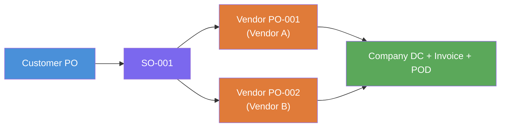
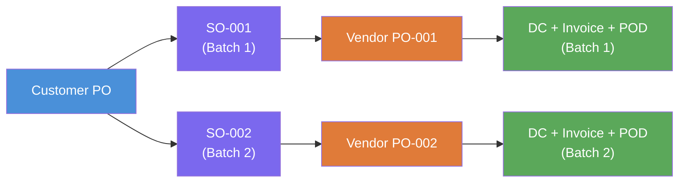
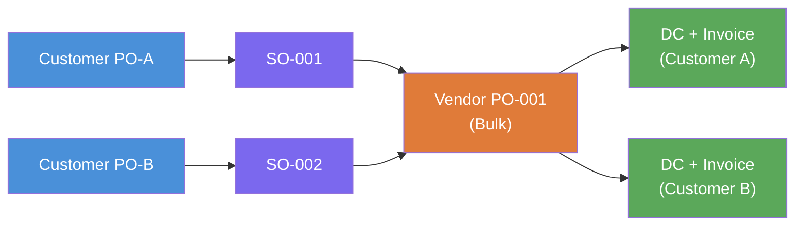

# Product Definition Document (PDD)
## Document Traceability & File Management Platform
### Logistics: Customer PO → Vendor Procurement → Delivery → Archival

---

## Version History

| Version | Date | Description |
|---|---|---|
| 0.1 | 2026-01-13 | Initial PDD — AS-IS analysis, MVP scope, NAS-based portal concept |
| 2.2.0 | 2026-03-14 | Production baseline: AI extraction pipeline, PENDING_MODEL status, SO cross-document validation, admin requeue |
| 2.3.0 | 2026-03-17 | Production hardening: Docker Compose prod setup, bug fixes, admin console |
| 3.0 (PDD) | 2026-03-26 | Added dispute resolution use case and cross-document data validation requirements (Sections 3, 4, 8.4, 10.3) |

---

## 1. Executive Summary

This PDD defines a centralised, on-premise platform to improve file management and document traceability for a logistics-oriented order lifecycle. The platform links all documents created against a customer requirement to a single unique ID and enables fast retrieval (file path + optional preview/download), with governance controls such as audit logs and approval-based update/delete.

From v3.0, the platform extends to **cross-document data validation**: automatically comparing extracted items, quantities, delivery addresses, and amounts across the 6-document chain to pre-build dispute evidence at processing time — eliminating manual comparison when customer claims arise months after delivery.

---

## 2. Business Context

**Business flow:**
Customer issues PO → Company performs internal processing and procurement → Issues Vendor PO → Receives vendor material/license with vendor invoice and DC → Delivers to customer with company invoice/DC → Collects signed acknowledgement (POD).

**Current tools/systems:**

- **.Net based ERP** — sales order (SO), OES, approvals, vendor PO, GRN, purchase bill, tax invoice/DC, tracking
- **Microsoft Outlook** — external communication with vendors (sending vendor PO PDFs)
- **NAS / intranet shared folders** — central repository for exports and scanned hard copies
- **Excel** — tracking internal

---

## 3. Problem Statement

**Observed pain points:**
- Documents are scattered across ERP, email, and multiple NAS folders — hard to find the right file at the right time
- During re-queries (customer/vendor follow-ups), teams struggle to confirm which documents exist for a specific customer requirement and where they are stored
- Required document set spans both company-side and vendor-side files (Customer PO; Vendor PO/DC/Invoice; Company Invoice/DC; signed acknowledgement/POD)
- Missing or misplaced files create operational risk
- Vendor negotiation and procurement variability causes timeline shifts, making it harder to track the latest document set
- Even when all documents are available, **verifying accuracy across the chain is manual and slow**. When a customer raises a dispute 2–3 months after delivery (wrong product, missing items, wrong delivery address), the team must manually open and compare 6 separate PDFs to verify what was ordered, what the vendor shipped, and what was actually delivered. This cross-checking is error-prone and time-consuming — and there is no pre-built evidence trail to quickly resolve the dispute.

**What the business expects:**
- Assign a unique ID per customer requirement (or reuse an existing stable ID)
- When a user enters the ID, the platform fetches and displays all related documents with file paths (Must), and optionally a preview + download (Good-to-have)
- When a dispute arises, the platform can immediately show a comparison of ordered vs delivered items, delivery addresses, and invoice amounts — pre-built at document processing time, retrievable in seconds

---

## 4. Objectives & Success Metrics

**Objectives:**
- Single view of all documents tied to a unique customer requirement ID
- Reduce document retrieval time and eliminate ad-hoc folder searching
- Improve governance with audit logs and approval-based privileged actions
- Enable incremental integration with ERP/CRM once documentation/access is available

**Candidate success metrics:**
- Average time to locate a case's key documents < 30 seconds
- ≥ 95% of cases meet the configured document checklist
- 100% of delete/update operations are approved and audited
- Cross-document item, address, and amount discrepancies flagged automatically at time of verification — before disputes arise
- Dispute evidence package for any PO retrievable in < 30 seconds

---

## 5. Stakeholders & Users

| Role | Responsibility |
|---|---|
| Sales Coordinator | Receives Customer PO; validates against internal quote; creates SO in ERP |
| Order Processing / OES | Creates SO/OES, attaches PO, manages approvals and costing updates |
| Purchase Team | Vendor negotiation, vendor PO creation, reschedule adjustments, release of vendor PO PDF |
| Logistics / Stores | GRN creation, inward validation, scanning vendor documents for archival |
| Finance | Purchase bill entry, tax invoice generation, compliance |
| Admin | Archival/scanning for customer delivery documents |
| Head / Manager | Approver for delete/update actions |

---

## 6. Current Process (AS-IS)

### 6.1 Process Phases

| Phase | Owner(s) | Key Activities | Primary Documents |
|---|---|---|---|
| 1. Input & Validation | Sales Coordinator / Ops | Receive customer PO (email); validate against internal quote; create SO in ERP | Customer PO; Quote/Proposal reference |
| 2. Order Entry & OES | Ops / OES / Finance | Create SO in ERP; attach PO; create OES (risk & margin checks); BOM entry; sequential internal approvals | SO; OES; BOM; approvals |
| 3. Procurement | Purchase Team | Offline vendor negotiation; vendor PO in ERP; reschedule when timelines shift; release PO PDF via Outlook | Vendor PO PDF; (re)schedule updates |
| 4. Inward Processing | Logistics / Stores / Finance | Vendor delivers material/license + vendor invoice/DC; create GRN; create purchase bill; update OES with actuals | GRN; Vendor Invoice; Vendor DC; Purchase Bill |
| 5. Outward & Closure | Ops / Logistics / Finance | Generate company DC and tax invoice; deliver to customer; collect signed POD/acknowledgement | Company Invoice; Company DC; Signed POD/Ack |

---

### 6.2 Document Traceability Chain (AS-IS)

The order lifecycle produces a chain of documents that reference each other through two key numbers: the **SO number** (internal, customer-facing side) and the **VPO number** (vendor-facing side). These two numbers are the backbone of traceability.

#### Complete Document Flow & Matching Loop

**Forward (creation):**

```
Customer PO received
    → ERP creates SO number (internal — never shown to vendor)
    → Against the SO, company issues Vendor PO (VPO number sent to vendor)
    → Vendor ships goods: Vendor DC and Vendor Invoice both print the VPO number
```

**Match (vendor documents → customer requirement):**

```
Vendor DC / Vendor Invoice received
    → Read VPO number from the document
    → VPO matches to SO in ERP
    → SO confirms which Customer PO and customer this belongs to
    → Vendor documents are now linked to the correct customer requirement
```

**Outward (billing):**

```
    → Against the same SO, company generates:
          Company DC      — printed with SO number ("Sales Order No.")
          Company Invoice — printed with SO number ("SO No.")
    → Delivered to customer → POD / acknowledgement collected → chain closed
```

#### Which Number Appears on Which Document

| Document | Reference Printed | Who Sees It |
|---|---|---|
| Customer PO | Customer's own PO number | Company (received from customer) |
| Company PO (VPO) | VPO number (e.g. 1PTR2526000467) | Vendor (sent by company) |
| Vendor DC | VPO number ("Other References") | Company (received from vendor) |
| Vendor Invoice | VPO number ("Other References") | Company (received from vendor) |
| Company DC | SO number ("Sales Order No.") | Customer (sent by company) |
| Company Invoice | SO number ("SO No.") | Customer (sent by company) |

#### How Traceability Works Today (ERP)

To find all documents for a customer requirement, an operator today must:

1. Know either the Customer PO number or the SO number
2. Open the ERP → search the SO → find the linked VPO numbers
3. Search NAS folders manually for each document by number

**The pain:** Documents are spread across ERP, email, and multiple NAS folders. There is no single place to see all 6 documents for one requirement. Finding files during a re-query (customer or vendor follow-up) takes significant time.

**What DPP solves:** All 6 documents are stored under one PO record. Search by any number — Customer PO, SO, VPO, invoice, or DC — and the platform finds the PO instantly, showing all documents, their statuses, and chain completeness in one screen.

---

## 7. Document Taxonomy & Checklist

### 7.1 Document Types

**Customer-side:**
- Customer PO (official PO PDF)
- Company Tax Invoice
- Company Delivery Challan (DC) — hardware scenario
- Signed customer acknowledgement / POD

**Vendor-side:**
- Vendor PO (company to vendor)
- Vendor Invoice
- Vendor Delivery Challan (DC)

**Internal supporting:**
- SOW, Quote/Proposal, BOM, OES, SO, GRN, Purchase Bill

### 7.2 Implemented Document Types (DPP v2.3.0)

| Enum Value | Direction | Primary Key Field | Status |
|---|---|---|---|
| CUSTOMER_PO | Customer → Us | po_number | ✅ Implemented |
| COMPANY_PO | Us → Vendor | po_number | ✅ Implemented |
| VENDOR_DC | Vendor → Us | dc_number | ✅ Implemented |
| VENDOR_INVOICE | Vendor → Us | invoice_number | ✅ Implemented |
| COMPANY_DC | Us → Customer | dc_number | ✅ Implemented |
| COMPANY_INVOICE | Us → Customer | invoice_number | ✅ Implemented |
| Signed POD / Acknowledgement | Customer → Us | — | ❌ Not yet implemented |

### 7.3 Minimum Metadata Fields

Case ID, Customer name, Customer PO number/date, Opportunity ID, SO number, Vendor name, Document type, Document number, Document date, Status (draft/signed), Source system, Storage location, Last modified date, Uploaded/linked by.

---

### 7.4 Document Flow by Order Type

Orders fall into three types, each with different document chain requirements.

#### Document Requirement Matrix

| Document | Trade / Software | Services (AMC, Cloud) | Stock / Inventory |
|---|---|---|---|
| Customer PO | Required | Required | Required |
| SO (internal) | Required | Required | Required |
| Vendor PO | Required | Required | Not applicable |
| Vendor DC | Required | If applicable | Not applicable |
| Vendor Invoice | Required | Required | Not applicable |
| Company DC | Required | If applicable | Required |
| Company Invoice | Required | Required | Required |
| POD | Required | Required | Required |

> **Services note:** Vendor DC and Company DC may or may not be generated depending on the vendor and delivery method. The chain is considered complete without them — they are "if applicable", not mandatory.
>
> **Stock/Inventory note:** When the ordered item is available in inventory, the entire vendor procurement block (Vendor PO → Vendor DC → Vendor Invoice) is skipped. The order is fulfilled directly from stock.

---

#### Type 1 — Trade / Software (Full Chain)


---

#### Type 2 — Services / AMC / Cloud (DC Optional)


---

#### Type 3 — Stock / Inventory Fulfillment (No Vendor Block)


> **Future enhancement:** Chain completeness % currently treats all 6 document types equally for all orders. A future `order_type` flag on the PO will allow the system to calculate completeness correctly per order type — e.g., a Services order at 6/6 applicable documents = 100%, even if Vendor DC was not generated.

---

### 7.5 Purchase Order Scenarios — CPO : SO : VPO Relationships

#### SO as the Backbone

The Sales Order (SO) is the internal reference that ties the entire chain together. It is generated inside the ERP after the Customer PO is received and is never visible to the vendor.

```
Customer PO received (e.g. SP-IT/Mum-148/25-26)
    ↓
ERP generates SO internally — purely internal, never printed on vendor-facing documents
    ↓
Against the SO, ERP generates a Vendor PO number (e.g. 1PTR2526000467)
Vendor PO is sent to the vendor — vendor sees only the VPO number, not the SO
    ↓
Vendor ships goods → Vendor DC and Vendor Invoice both reference the VPO number
    ↓
ERP lookup: VPO number → finds SO → finds Customer PO → finds Customer
    ↓
Company DC dispatched → prints Customer Order No (CPO) + Sales Order No (SO)
Company Invoice issued → prints Customer Order No (CPO) + ref (NOT the VPO number)
```

**Where the SO number appears:**

- ✅ Company DC — printed as "Sales Order No."
- ✅ Company Invoice — printed as "SO No." or reference
- ❌ Vendor PO — not printed (vendor sees only the VPO number)
- ❌ Vendor DC — not printed
- ❌ Vendor Invoice — not printed

The PO number is the traceability link on the vendor side. The SO is the traceability link on the customer-facing side. Both map to each other only inside the ERP.

#### Relationship Matrix

| CPO | SO | VPO | Description |
|---|---|---|---|
| 1 | 1 | 1 | Standard single-vendor fulfillment |
| 1 | 1 | Many | One order, items from multiple vendors |
| 1 | Many | Many | One CPO split into batches or separate line item flows |
| Many | Many | 1 | Multiple customer SOs fulfilled via one bulk vendor purchase |
| Many | Many | Many | Multiple independent customer orders, each with own chain |

> **Key rule:** SO and VPO have a **many-to-many relationship**. One SO can have multiple VPOs (multi-vendor), and one VPO can serve multiple SOs (bulk procurement).

---

#### Scenario 1 — Standard (1 CPO : 1 SO : 1 VPO)

Most common case. Single customer order, single vendor.


---

#### Scenario 2 — Multi-Vendor (1 CPO : 1 SO : Many VPO)

Customer orders items from different vendors. One SO, multiple Vendor POs raised.

**Real example (Hindalco SDWAN order):** Customer PO SP-IT/Mum-148/25-26 resulted in two Vendor POs — `9POT2526000007` to Techknowlogic (hardware + SaaS) and `9POT2526000008` to Inflow Technologies (SFP transceivers). Both vendors printed Skylark's PO number in their invoices under "Other References", so the link is traceable via the `po_reference` field already extracted from VENDOR_INVOICE.

**What the current system supports:** Each VENDOR_INVOICE extraction captures `po_reference` (the VPO number). Multiple COMPANY_PO documents can be uploaded under one PurchaseOrder, each with its own `po_number`. The VPO↔VendorInvoice link is in the extracted data.

**Remaining gaps:** The system has one VENDOR_INVOICE slot in chain completeness — it does not track that one VPO can generate multiple invoices (e.g. one for hardware, one for services). There is no explicit grouping of which VENDOR_INVOICE belongs to which COMPANY_PO document.



---

#### Scenario 3 — Split Delivery (1 CPO : Many SO : Many VPO)

Customer PO is large — delivered in batches. Each batch gets its own SO and vendor procurement.



---

#### Scenario 4 — Bulk Procurement (Many SO : 1 VPO)

Company bulk-buys from one vendor to fulfill multiple customer SOs in a single Vendor PO (cost efficiency / stock replenishment).



---

#### Architectural Gap — Current System

| Aspect | Current System | Reality |
|---|---|---|
| CPO → SO | 1 PO record = 1 SO number field | 1 CPO can generate multiple SOs |
| SO → VPO | No explicit SO↔VPO link | Many-to-many relationship |
| Bulk procurement | Not tracked | 1 VPO can serve multiple SOs |
| Partial delivery | Not tracked | 1 CPO can have multiple delivery batches |

**Current limitation:** The `purchase_orders` table stores one `so_number` per PO — assumes 1:1 between PO and SO. The system cannot currently link one Vendor PO to multiple SOs or track partial deliveries against a single CPO.

**Future fix:** Introduce a `SalesOrder` entity and a `SOVendorPOLink` join table to properly model the many-to-many relationship between SOs and Vendor POs.

---

### 7.6 Billing Scenarios

#### Billing Types

| Type | Description | Typical Order |
|---|---|---|
| Full billing | Single invoice for the entire PO amount | Trade / Software / Stock |
| Partial billing | Invoice raised per batch / per delivery | Split delivery (Scenario 3) |
| Recurring billing | Invoice raised on a fixed schedule | Services / AMC / Cloud |

---

#### Type 1 — Full Billing

One Customer PO → one SO → one Company Invoice for the full amount. Most straightforward case.

```
Customer PO (100%) → SO → Vendor PO → Vendor Invoice → Company Invoice (100%) → POD
```

---

#### Type 2 — Partial Billing

Customer PO delivered and billed in batches. Each batch generates its own Company DC and Company Invoice for that portion.

```
Customer PO (total ₹100)
    ├── Batch 1 (₹40) → SO-001 → Vendor PO-001 → Company DC-001 + Invoice-001
    └── Batch 2 (₹60) → SO-002 → Vendor PO-002 → Company DC-002 + Invoice-002
```

> Sum of all partial invoices = total Customer PO value.

---

#### Type 3 — Recurring Billing

Used for service contracts (AMC, cloud subscriptions, support contracts). The same contract generates invoices periodically over the contract duration.

**Billing frequencies:**

| Frequency | Invoices per year | Example |
|---|---|---|
| Monthly | 12 | Cloud subscription billed monthly |
| Quarterly | 4 | Maintenance contract billed per quarter |
| Half-yearly | 2 | AMC billed twice a year |
| Yearly | 1 | Annual license renewal |

**Two sub-cases depending on vendor arrangement:**

**Sub-case A — Vendor also recurs (both sides repeat each cycle)**
e.g., Cloud subscription: vendor bills company monthly → company bills customer monthly.

```
Contract Start
    ├── Month 1: Vendor Invoice → Company Invoice (Month 1)
    ├── Month 2: Vendor Invoice → Company Invoice (Month 2)
    ├── ...
    └── Month 12: Vendor Invoice → Company Invoice (Month 12)
```

**Sub-case B — Vendor one-time, company recurs (only outgoing side repeats)**
e.g., AMC: hardware/license procured once from vendor → company bills customer annually.

```
Contract Start
    ├── One-time: Vendor PO → Vendor Invoice (procurement)
    ├── Year 1: Company Invoice (AMC fee Year 1)
    ├── Year 2: Company Invoice (AMC fee Year 2)
    └── Year 3: Company Invoice (AMC fee Year 3)
```

---

#### Billing vs Document Chain

| Billing Type | Customer PO | SO | Vendor PO | Company Invoice | POD |
|---|---|---|---|---|---|
| Full billing | 1 | 1 | 1 | 1 | 1 |
| Partial billing | 1 | Many | Many | 1 per batch | 1 per batch |
| Recurring — Vendor recurs | 1 | 1 per cycle | 1 per cycle | 1 per cycle | As applicable |
| Recurring — Vendor one-time | 1 | 1 | 1 | 1 per period | As applicable |

> **Architectural gap:** The current system has no `billing_type`, `contract_start_date`, `billing_frequency`, or `contract_duration` fields. Recurring billing cycles cannot be auto-generated or tracked. This is a planned feature for a future version.

---

### 7.7 Delivery Location

Delivery address is one of the fields extracted from documents. The Customer PO contains the Ship To address (where goods should be delivered), and the Company DC contains the delivery address confirming where goods were dispatched. Address text is stored in `extracted_data` JSON — there is no dedicated structured column for it yet.

#### Delivery Scenarios

| Scenario | Description |
| --- | --- |
| Same site | Billing address and delivery address are the same |
| Different site | Customer PO specifies a Ship To address different from billing address |
| Multi-site | Customer wants items delivered to multiple locations — separate DC per site |
| Drop-ship | Vendor ships directly to customer's site, bypassing company warehouse |

---

## 8. Proposed Solution (TO-BE)

A centralised portal indexes all documents in the order lifecycle against a unique Case ID (SO Number), with AI-assisted extraction, cross-document validation, and a structured review workflow.

**Primary user journey:** Upload document → AI extracts metadata → Operator reviews and corrects → Verified document linked to PO → Full chain visible on PO detail page

**Fallback journey (Manual Entry):** When the AI service is offline or extraction fails → operator clicks Manual Entry on the document card → review screen opens with empty fields → operator fills in metadata by reading the source document on the left → clicks Verify → document is fully verified and joins the chain as normal

---

### 8.1 What Works Today (DPP v2.5.1)

- Upload and store all 6 document types under a Purchase Order
- AI extraction (GLM-OCR → Qwen2.5:3b) from scanned PDFs and images; digital PDF fast path (no GPU) for text-selectable PDFs
- Structured metadata extraction with field-level validation and per-field confidence scores
- Chain completeness tracking (% of documents verified)
- Human review and correction of AI-extracted fields (PENDING_REVIEW → VERIFIED / REJECTED)
- Manual Entry fallback — when AI is unavailable or fails, operator fills all fields by hand; same Verify/Reject workflow applies; work continues uninterrupted
- Operator Remarks — free-text notes field always visible in Review modal; persisted per document
- Custom Fields — operator can add any extra label+value pair to a document during review (e.g. freight charge, special reference); stored alongside standard fields
- PENDING_MODEL status — pre-flight model check before extraction; if endpoint or model unavailable, document is held in PENDING_MODEL and retried manually via admin requeue; distinguishes model outages from extraction failures
- Cross-document SO number validation — runs automatically when COMPANY_DC or COMPANY_INVOICE is processed; frontend SO entry prompt not yet built
- **PO Profile page** — consolidated read-only view of all 6 document slots for a PO; shows extracted fields, per-field confidence colours, document status, and cross-reference discrepancies (SO mismatches, missing PO references); includes a chronological event timeline
- **Excel Export** — export full PO data as a workbook; two modes: multi-sheet (summary, chain, fields, items, locations, timeline, discrepancies) or single consolidated sheet; auto-downloads from profile page
- PDF preview with zoom (Ctrl+scroll / pinch) and rotation — available in Review modal and Profile page
- Global toast notifications for extraction outcomes, network errors, and service status
- Admin health monitoring (DB, Redis, OCR service, storage) with parallelised health checks and 30s cache
- Celery queue status and worker visibility in Admin console
- Docker Compose production setup (on-prem deployment ready)

---

### 8.2 Capability Matrix

Maps every business scenario documented in Section 7 to the current system's ability to handle it.

**Legend:** ✅ Possible — ⚠️ Partial (works but with known gaps) — ❌ Not possible (not yet built)

#### Order Types

| Scenario | Status | Gap / Note |
|---|---|---|
| Trade / Software — full 6-document chain | ✅ | All 6 document types supported |
| Services — DC optional (chain complete without DC) | ⚠️ | Chain completeness % counts missing DC as incomplete; no `order_type` flag to skip it |
| Stock / Inventory — no vendor block | ⚠️ | No `order_type` flag; vendor document slots appear as missing on the chain bar |

#### CPO : SO : VPO Relationships

| Scenario | Status | Gap / Note |
|---|---|---|
| 1 CPO : 1 SO : 1 VPO (standard) | ✅ | Fully supported — standard case |
| 1 CPO : 1 SO : Many VPO (multi-vendor) | ⚠️ | Multiple Vendor POs can be uploaded under one PO; vendors print the VPO number on their invoices so the link is traceable. Gap: chain completeness has one Vendor Invoice slot regardless of how many VPOs exist; no explicit per-VPO grouping |
| 1 CPO : Many SO : Many VPO (split delivery) | ❌ | No split delivery tracking; one PO = one SO number field |
| Many SO : 1 VPO (bulk procurement) | ❌ | No bulk procurement linking across POs |

#### Billing

| Scenario | Status | Gap / Note |
|---|---|---|
| Full billing — single invoice per PO | ✅ | Supported |
| Partial billing — invoice per batch | ❌ | No batch tracking; no partial invoice model |
| Recurring — vendor recurs (both sides repeat per cycle) | ❌ | No `billing_frequency` or cycle tracking |
| Recurring — vendor one-time, company recurs | ❌ | No contract duration or recurring invoice model |

#### Delivery Location

| Scenario | Status | Gap / Note |
|---|---|---|
| Delivery address extracted from Customer PO | ✅ | Address captured in `extracted_data` JSON if LLM picks it up |
| Delivery address extracted from Company DC | ✅ | Same — captured in extracted JSON |
| Structured `delivery_address` field on PO model | ❌ | Address in JSON blob only; not a dedicated searchable column |

#### Cross-Document Data Validation

| Scenario | Status | Gap / Note |
|---|---|---|
| Item extraction from CUSTOMER_PO | ✅ | `order_items` array extracted |
| Item extraction from other 5 document types | ❌ | Not extracted — prompts do not capture line items for these types |
| Item cross-matching (CUSTOMER_PO vs COMPANY_DC) | ❌ | Not built |
| Delivery address cross-matching (CUSTOMER_PO vs COMPANY_DC) | ❌ | Not built |
| Amount cross-matching (CUSTOMER_PO vs COMPANY_INVOICE) | ❌ | Not built |
| Dispute discrepancy panel on PO Profile | ⚠️ | SO/PO reference discrepancies shown; item/address/amount comparisons not yet added |
| Dispute evidence export | ⚠️ | Excel export exists; item-level dispute comparison view not added |

---

### 8.3 Roadmap Gaps

The following capabilities are not yet built and are required for full business coverage:

| Gap | Priority | Planned In |
|---|---|---|
| `order_type` flag on PO (Trade / Services / Stock) | High | v2.4.0 |
| Chain completeness respects order type rules | High | v2.4.0 |
| `SalesOrder` entity + `SOVendorPOLink` join table (many-to-many) | High | v3.0 |
| Split delivery tracking (1 CPO → many SO batches) | Medium | v3.0 |
| Partial billing tracking (batch invoices summing to PO total) | Medium | v3.0 |
| Recurring billing model (`billing_frequency`, `contract_duration`) | Low | v3.1 |
| Structured `delivery_address` field on PO model (from CPO extraction) | Medium | v2.4.0 |
| Item extraction from all 6 document types | High | v3.0 |
| Item + address + amount cross-matching engine | High | v3.0 |
| Discrepancy panel extended with item-level comparison detail | High | v3.0 |
| Dispute evidence export tab in Excel workbook | Medium | v3.0 |

---

### 8.4 Cross-Document Data Validation (Planned — v3.0)

The core value addition for the dispute resolution use case. After documents are uploaded and extracted, the system automatically compares structured data across the chain and surfaces discrepancies — so when a customer dispute arrives months later, the evidence is already pre-built and retrievable in seconds.

#### What Gets Cross-Matched

**1. Item Matching**

Extract line items (product description, quantity, unit, HSN/part number) from all 6 document types and compare:

| Comparison | What it detects |
|---|---|
| CUSTOMER_PO items vs COMPANY_DC items | Items ordered by customer vs items actually dispatched |
| COMPANY_DC items vs VENDOR_DC items | Items delivered to customer vs items received from vendor |
| COMPANY_PO items vs VENDOR_INVOICE items | Items ordered from vendor vs items vendor billed for |

Flags raised:

- **Missing item** — item on source document not found in target (e.g. item on CUSTOMER_PO not on COMPANY_DC)
- **Item mismatch** — description or part number differs across documents
- **Quantity mismatch** — quantity differs across the chain

**2. Delivery Address Matching**

- Extract `ship_to` / `delivery_address` from CUSTOMER_PO
- Extract `dispatch_to` / `delivery_address` from COMPANY_DC
- Flag as **Address mismatch** if they differ

**3. Amount Matching**

| Comparison | What it detects |
|---|---|
| CUSTOMER_PO total vs COMPANY_INVOICE total | Was the customer billed the correct amount? |
| COMPANY_PO total vs VENDOR_INVOICE total | Did the vendor bill what was agreed? |

Flags raised:

- **Amount mismatch** — totals differ beyond a configurable tolerance (default: ₹0)

#### Discrepancy Severity Model

| Type | Severity | Meaning |
|---|---|---|
| Missing item | Error | Item ordered but not present in delivery or invoice |
| Item mismatch | Error | Wrong product description or part number in chain |
| Quantity mismatch | Error | Wrong quantity delivered or billed |
| Address mismatch | Warning | Delivery location on DC differs from Customer PO |
| Amount mismatch | Warning | Invoice total differs from PO total |
| Missing PO reference | Info | Document does not reference the linked PO number |

#### Dispute Evidence Access

All discrepancies are computed when each document is verified and stored against the PO. When a dispute arises, the operator opens the PO Profile page to see:

- Green banner if no discrepancies found across the chain
- Error/warning rows with: document pair, field name, expected value, actual value
- Downloadable dispute evidence report (extends existing Excel export) with side-by-side comparison of key fields

This eliminates manual cross-checking at the time of the dispute — the comparison is done at processing time and the result is instant to retrieve.

---

## 9. Scope & Phasing

### 9.1 Original Plan (v0.1 — January 2026)

| Phase | Scope | Status |
|---|---|---|
| Phase 1 — NAS Portal (MVP) | Case ID creation, manual document linking, file path list, audit logs, approval workflow | Superseded — never built |
| Phase 2 — AI Extraction | OCR + LLM-based metadata extraction, on-prem deployment | Completed (DPP v2.2.0+) |
| Phase 3 — Integrations | ERP sync, multi-user roles, audit logs | Pending |

The v0.1 plan called for a lightweight NAS index portal as MVP, with AI extraction as a later phase. In practice, Phase 1 was skipped entirely — the team jumped directly to AI extraction as the core feature.

### 9.2 Actual Development Path

| Milestone | Version | Date | What Was Built |
|---|---|---|---|
| Concept | v0.1 | Jan 2026 | NAS portal concept (never built) |
| Case-based portal | Phase 1.0 | Jan 2026 | Backend only: Case + SalesOrder + Document entities, NAS storage, SHA-256 dedup, 6 doc types |
| SO hierarchy | Phase 1.1 | Jan 2026 | Case → SO → Document hierarchy; month-locked SO numbers |
| First AI extraction | Phase 2.0 | Feb 2026 | GLM-OCR integration, synchronous extraction, DocumentMetadata model |
| Full platform rewrite | Phase 2.1 | Feb 2026 | PurchaseOrder-centric model, Customer master, Celery async pipeline, JWT auth, UUID PKs, ReferenceIndex |
| Two-layer OCR | Phase 2.1.0 | Feb 2026 | glm-ocr + qwen2.5:7b, VRAM management, circuit breaker pattern |
| Production baseline | DPP 2.2.0 | Mar 2026 | PENDING_MODEL status, SO cross-doc validation, admin requeue endpoint |
| Production hardening | DPP 2.3.0 | Mar 2026 | Docker Compose prod setup, multi-stage Dockerfiles, bug fixes |

### 9.3 Next Phase (Planned)

| Item | Priority | Notes |
|---|---|---|
| Frontend SO entry prompt | High | Modal/input after CUSTOMER_PO verify so operator can set the SO number; backend already done |
| ERP integration | High | Read SO/invoice data directly from .Net ERP to reduce manual entry |
| Multi-user auth + RBAC | High | Currently no authentication; anyone on the network can access |
| Audit logs | High | Compliance requirement; no record of who verified or changed what |
| Approval workflow (update/delete) | Medium | Manual delete with no approval gate currently |
| SO:VPO many-to-many | Medium | Current model assumes 1:1; actual business has multi-vendor SOs |
| Order-type-aware chain completeness | Medium | Services orders should not count DC as missing |
| Structured `delivery_address` field | Medium | Store extracted delivery address as dedicated column |

---

## 10. Functional Requirements

### 10.1 Core Document Management

| FR ID | Priority | Requirement | Status |
|---|---|---|---|
| FR-01 | Must | Unique PO-level Case ID (create/search/view) | ✅ UUID-based PO ID |
| FR-02 | Must | Link documents to PO (upload per document type) | ✅ |
| FR-03 | Must | Document list shows type, filename, status, timestamps | ✅ |
| FR-04 | Must | Controlled document taxonomy (6 types) + required-doc checklist | ✅ Chain completeness % |
| FR-05 | Should | Preview for PDF/images; download | ✅ PDF inline preview and download in-browser |
| FR-06 | Must | Audit logs for all key user actions | ❌ Pending |
| FR-07 | Must | Approval workflow for document update/delete | ❌ Pending |
| FR-08 | Could | ERP sync for SO/OES/GRN/Purchase Bill/Invoice metadata | ❌ Pending |

### 10.2 AI Extraction Pipeline

| FR ID | Priority | Requirement | Status |
|---|---|---|---|
| FR-10 | Must | OCR extraction from uploaded PDFs and images | ✅ GLM-OCR (Layer 1) |
| FR-11 | Must | Structured metadata extraction per document type | ✅ Qwen2.5:7b (Layer 2) |
| FR-12 | Must | Human review and correction of extracted fields | ✅ Review modal with field editing |
| FR-13 | Must | Verify / Reject workflow per document | ✅ VERIFIED / REJECTED statuses |
| FR-14 | Must | Extraction failure handling with error details | ✅ EXTRACTION_FAILED + last_error |
| FR-15 | Should | Re-extraction on demand (with overwrite confirmation) | ✅ Re-extract button |
| FR-16 | Should | Pre-flight check before extraction (model availability) | ✅ PENDING_MODEL status |
| FR-17 | Must | When extraction is unavailable or fails, operator can manually fill in document metadata through the same review screen | ✅ Manual Entry button on document card; review screen with manual mode; all 6 document types supported |
| FR-18 | Should | Operator can add custom free-text fields (label + value) to any document during review or editing | ✅ Add Field button in review and edit screens |

### 10.3 Cross-Document Validation

| FR ID | Priority | Requirement | Status |
|---|---|---|---|
| FR-20 | Must | After CUSTOMER_PO is verified, operator enters the ERP-generated SO number against that PO — this becomes the reference for all future validations on that chain | ⚠️ The SO number field exists on the PO record and is saved correctly — but there is no screen for the operator to enter it after verifying the Customer PO. Validation never triggers until this is built. |
| FR-21 | Must | SO number cross-validated on COMPANY_DC and COMPANY_INVOICE | ✅ so_validator.py |
| FR-22 | Should | Mismatch flagged in document validation errors (PENDING_REVIEW) | ✅ |
| FR-23 | Could | Structured delivery address field extracted from Customer PO and stored on PO model | ❌ Pending |
| FR-24 | Must | Extract line items (description, qty, unit price, HSN/part number) from all 6 document types during extraction | ❌ Pending — v3.0 |
| FR-25 | Must | Cross-match CUSTOMER_PO items vs COMPANY_DC items — flag missing items, item mismatches, and quantity mismatches | ❌ Pending — v3.0 |
| FR-26 | Must | Cross-match delivery address: CUSTOMER_PO `ship_to` vs COMPANY_DC `dispatch_to` — flag address mismatches | ❌ Pending — v3.0 |
| FR-27 | Should | Cross-match amounts: CUSTOMER_PO total vs COMPANY_INVOICE total; COMPANY_PO total vs VENDOR_INVOICE total | ❌ Pending — v3.0 |
| FR-28 | Should | Cross-match VENDOR_DC items vs COMPANY_PO items — detect vendor shipment accuracy against what was ordered | ❌ Pending — v3.0 |
| FR-29 | Must | All discrepancies surfaced on PO Profile page with severity level, affected document pair, expected vs actual values | ❌ Pending — v3.0 |

### 10.4 Search and Navigation

| FR ID | Priority | Requirement | Status |
|---|---|---|---|
| FR-30 | Must | Global search by PO number, invoice number, DC number, SO number | ✅ ReferenceIndex full-text search |
| FR-31 | Should | Filter POs by customer, status, date range, chain completeness | ✅ date_from, date_to, sort_by, chain_filter, missing_doc_type all implemented |
| FR-32 | Should | Documents page with cross-PO filter by type, status, customer | ✅ DocumentsPage with type, status, customer_id filters |
| FR-33 | Could | Unified pending review queue across all POs | ❌ Pending |

### 10.5 Admin and Ops

| FR ID | Priority | Requirement | Status |
|---|---|---|---|
| FR-40 | Must | System health check (DB, Redis, OCR, storage) | ✅ Admin console |
| FR-41 | Must | Pipeline stats (document counts by status) | ✅ |
| FR-42 | Must | Celery queue status (workers, active, queued) | ✅ |
| FR-43 | Should | Requeue documents stuck in PENDING_MODEL | ✅ POST /admin/requeue-pending-models |
| FR-44 | Could | Extraction failure analysis with error categorisation | ⚠️ Raw error shown; no categorisation |

---

## 11. Non-Functional Requirements

| NFR ID | Category | Requirement | Status |
|---|---|---|---|
| NFR-01 | Deployment | On-premise capable; Docker Compose single-server deployment | ✅ docker-compose.prod.yml |
| NFR-02 | Security | Role-based access control; no anonymous access | ❌ No auth yet — planned v3.0 |
| NFR-03 | Privacy | No external data transfer for document content | ✅ Local Ollama option; RunPod used only for OCR model |
| NFR-04 | Auditability | Immutable audit logs for document actions | ❌ Pending |
| NFR-05 | Performance | Search results < 2 seconds | ✅ ReferenceIndex + indexed queries |
| NFR-06 | Reliability | DB backups + documented restore procedure | ❌ Pending |
| NFR-07 | Scalability | Multiple Celery workers for parallel extraction | ✅ docker-compose deploy.replicas |
| NFR-08 | Observability | Health endpoint + admin console for ops visibility | ✅ |
| NFR-09 | Portability | Runs on Windows (dev) and Linux (production) | ✅ Tested on both |
| NFR-10 | Document formats | PDF accepted for upload | ⚠️ PDF  ✅; JPEG, PNG rejected by frontend — fix pending |

---

## 12. Data Model

### 12.1 Current Entities (DPP v2.3.0)

| Entity | What it stores |
|---|---|
| Customer | Company name, code, contact details |
| PurchaseOrder | PO number, SO number, customer, status, chain completeness % |
| Document | Document type, filename, upload status, file location |
| DocumentMetadata | AI-extracted fields, validation errors, extraction attempts, last error |
| ReferenceIndex | Cross-document lookup — maps any reference number to its document and PO |

### 12.2 Document Status Lifecycle

```text
UPLOADED → EXTRACTING → PENDING_REVIEW → VERIFIED
                      ↘ EXTRACTION_FAILED
                      ↘ REJECTED
                      ↘ PENDING_MODEL  (OCR endpoint unavailable)
```

---

## 13. Solution Options Evaluated

| Option | Description | Decision |
|---|---|---|
| A — NAS Index + Web Portal | Lightweight portal indexing NAS folders, metadata in local DB | Planned as MVP; never built |
| B — Integrated Portal (ERP) | Connectors to .Net ERP to auto-populate SO/invoice metadata | Deferred — ERP API access not yet available |
| C — OCR/LLM-Assisted Intake | On-prem OCR + LLM to extract metadata from scanned documents | ✅ Implemented — core platform as of DPP v2.2.0 |

**Actual path taken:** Skipped Option A entirely; implemented Option C as the primary approach. Option B remains a future integration target.

---

## 14. Risks & Mitigations

| Risk | Impact | Mitigation |
|---|---|---|
| OCR quality on bad scans | Extraction fails or produces wrong data | Re-upload with better scan; operator correction in review modal |
| OCR service goes down | All extraction stops | Admin health check flags it in real time; local fallback available |
| No authentication | Any user on the network can access and modify data | Acceptable for single-team internal use; auth planned for next version |
| ERP API unavailable | Manual SO/invoice entry required | Operator enters SO number manually after Customer PO is verified |
| No audit trail | Cannot trace who changed or verified a document | Planned: user login + audit log table in next version |
| Adoption — teams continue saving files ad-hoc | Documents not uploaded to DPP | SOP enforcement required; completeness alerts help identify gaps |
| Data loss on server failure | No backup configured | PostgreSQL dump + storage folder backup procedure to be documented |

---

## 15. Open Questions (Current — DPP v2.3.0)

*Questions from v0.1 that are now resolved are struck out. New open questions added below.*

**Resolved from v0.1:**

- Primary key decision → **resolved:** UUID-based PO ID; SO number stored as a field after Customer PO is verified
- Document checklist per scenario → **partially resolved:** 6 document types defined; order-type-aware rules (Services/Stock) pending
- Search beyond Case ID → **resolved:** global search by PO number, invoice number, DC number, SO number via ReferenceIndex

**Still open:**

1. Order type flag (Trade / Services / Stock) — how should the operator set this? Manual selection on PO creation, or inferred from extracted fields?
2. For Services orders, which document types should count as optional in chain completeness?
3. ERP integration method — API access, DB read, or standardised export file?
4. Retention policy — how long should documents and metadata be kept?
5. Who is the approver for document delete/update, and how should they be notified?
6. POD / signed acknowledgement handling — scanned document or digital signature capture?

---

## 16. Acceptance Criteria (DPP v2.3.0)

### Already Met

- Upload documents for all 6 types under a PO
- AI extraction produces structured metadata per document type
- Operator can review, correct, verify, or reject extracted data
- Chain completeness % visible per PO
- Global search finds documents by PO number, invoice, DC number, SO number
- Admin console shows system health, pipeline stats, queue status
- PDF in-browser preview and download
- SO number stored on PO and validated against COMPANY_DC / COMPANY_INVOICE
- Operator can manually fill in document metadata when AI extraction is unavailable or fails
- Operator can add custom free-text fields to any document during review or editing

### Not Yet Met

- Signed POD / Acknowledgement as a 7th document type
- Audit logs (who verified, who changed, when)
- Approval workflow for document update or delete
- Multi-user authentication and role-based access control
- .Net ERP integration (SO / invoice data auto-populated from ERP)
- Order-type-aware chain completeness (Services / Stock rules)
- Structured delivery address field extracted from Customer PO

---

## 17. Current Implementation Status (DPP v2.3.0)

### What's Working

- Customer and PO management (create, list, search, update, delete)
- Document upload and management for all 6 document types
- AI extraction pipeline: automated OCR + structured data extraction per document type
- Human review and correction of extracted data
- Verify / Reject workflow with status tracking
- Chain completeness % per PO (tracks which document types are present and verified)
- Global search by PO number, invoice number, DC number, SO number
- Extraction health check — if the AI service is unavailable, the document is flagged for later retry instead of failing silently
- Admin console — system health, pipeline stats, queue status, failure diagnostics
- Documents page — cross-PO document list filterable by type, status, and customer
- Filter system on PO list — date range, SO number, sort, chain completeness, missing document type
- Operator remarks — free-text notes field on every document; saved with the verification record
- Custom Fields — operators can add any number of extra label+value pairs during review or editing; captures information the AI missed or fields not in the standard template
- Manual Entry fallback — when extraction fails or the AI service is offline, operators fill all document fields by hand via the same review screen; supports all 6 document types and custom fields
- PDF in-browser preview and download


### Partially Working

- **SO number cross-document validation** — the system is built and runs automatically during extraction. When COMPANY_DC or COMPANY_INVOICE is processed, the extracted SO number is compared against the SO recorded on the PO. **Gap:** operators have no screen to record the SO number after verifying a Customer PO, so the comparison never has a value to check against. This requires a small addition to the verification screen.

### Pending

- SO entry screen for operators — input field after Customer PO verification to record the SO number
- Signed POD / Acknowledgement (7th document type)
- Audit logs (who verified what, when)
- Approval workflow for document update or delete
- Multi-user authentication and role-based access control
- .Net ERP integration
- Order-type-aware chain completeness (Services vs Stock rules)
- Structured delivery address field on PO
