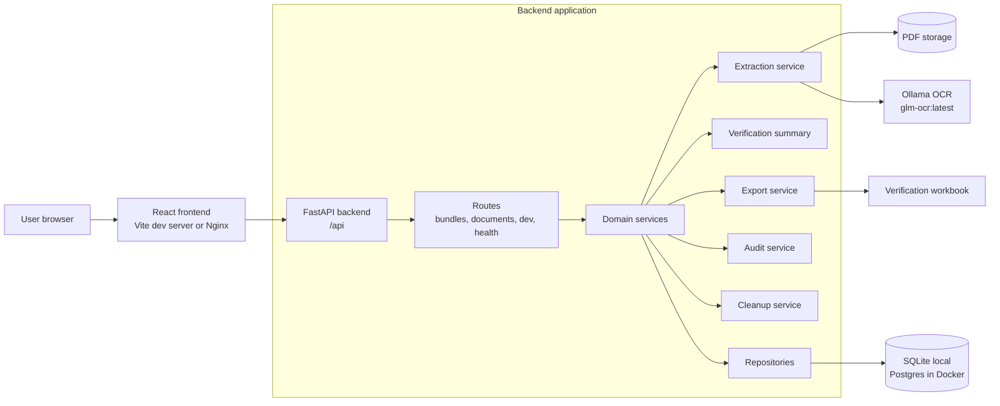
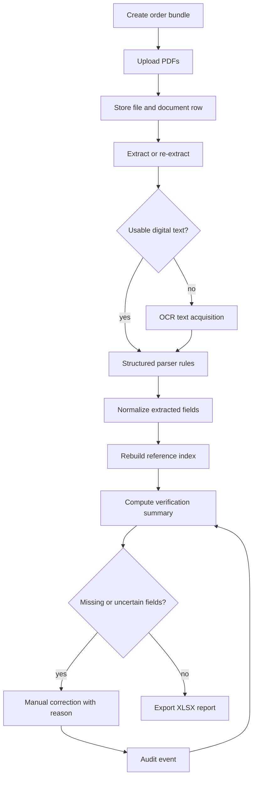

# Order Assurance Architecture

Order Assurance is isolated under `order-assurance/` and uses app-local imports only. It is not a live integration with the legacy ODMP backend or frontend.

## Runtime Architecture



## Backend Components

- `app.api.routes`: FastAPI routes for health, bundles, documents, and gated development tools.
- `app.domain`: enums and core status types.
- `app.models`: SQLAlchemy models for bundles, documents, metadata, reference index, evidence, and audit events.
- `app.repositories`: database access wrappers used by services and routes.
- `app.services`: document storage, extraction, verification, export, audit, cleanup, and demo seed logic.
- `app.services.extraction`: digital text extraction, OCR provider routing, structured parsing, evidence capture, and optional model-layer extraction.
- `app.migrations`: lightweight SQL migration runner for the independent schema.

## Frontend Components

The frontend is a Vite/React application with workflow pages for:

- bundle list
- bundle overview
- document upload/review
- extraction review
- verification checks
- issues
- audit trail
- export readiness
- health

The frontend calls the backend through `VITE_API_BASE_URL`. Local manual runs can use `http://127.0.0.1:8100/api`; `scripts/run-local.ps1` and Docker use `/api` with a proxy.

## Document Assurance Flow



## Extraction Policy

The extraction policy is correct-or-blank:

- Digital PDF text is preferred when available.
- OCR is text acquisition only; parser rules still extract structured fields.
- Model Layer 2 is experimental and disabled by default.
- Manual correction is the recovery path for missing, low-confidence, or rejected fields.
- Verification status is computed by deterministic verifier logic, not by OCR or model output.

## Deployment

`docker-compose.yml` runs only the standalone Order Assurance services:

- backend on `http://127.0.0.1:8100`
- frontend on `http://127.0.0.1:5180`
- Postgres exposed on host port `15432`
- Docker-managed document storage volume

The backend container runs `python -m app.migrations.runner up` before Uvicorn starts. The frontend container serves the built SPA through Nginx and proxies `/api` to the backend service.

## Environment-Gated Dev Tools

`POST /api/dev/seed-panimalar` and evidence inspection endpoints are available only when `APP_ENV=development` or `ENABLE_DEV_TOOLS=true`.

The script seed path remains available for local operations:

```powershell
cd order-assurance/backend
python -m app.scripts.seed_panimalar_demo
```

## Deferred Production Concerns

- Auth/RBAC is intentionally held for a later phase.
- Line-item description matching is not part of this application.
- ERP integration is not implemented.
- Production multi-tenant hardening is out of scope for the current local/demo deployment.
